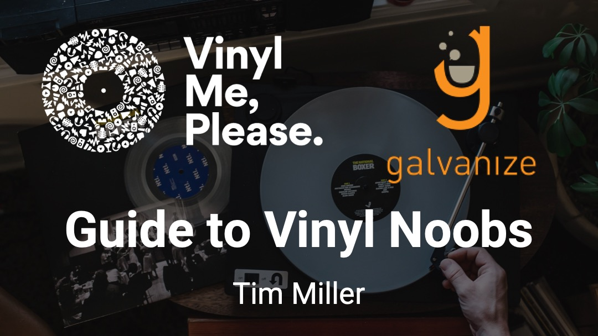
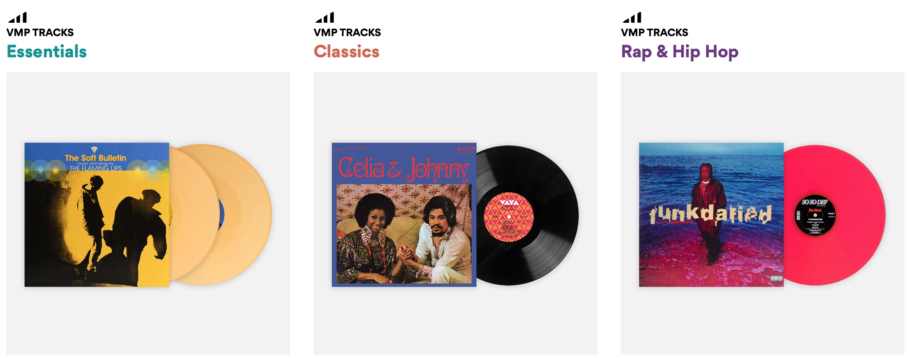
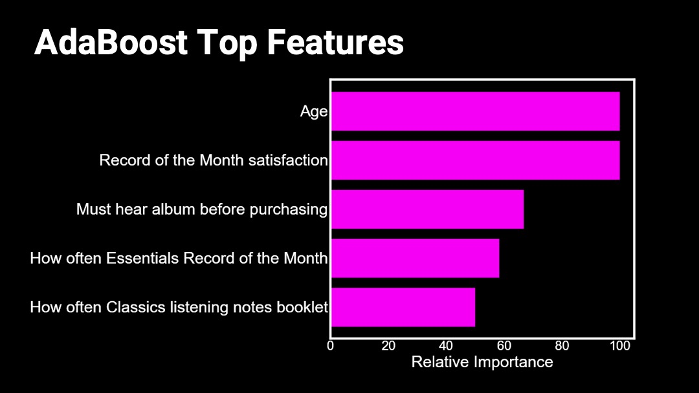
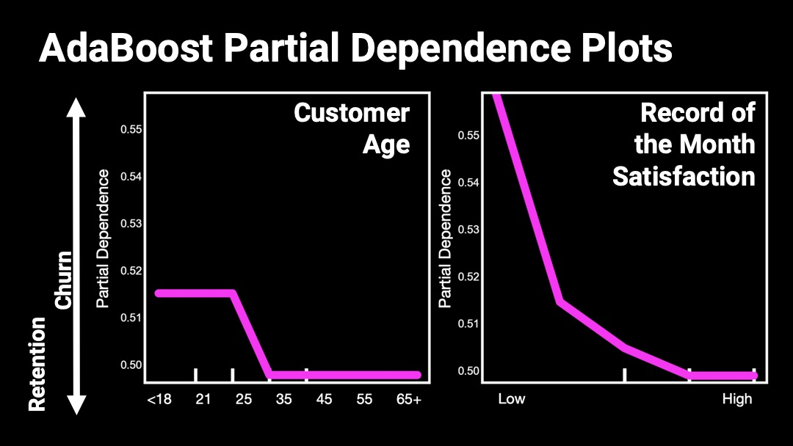
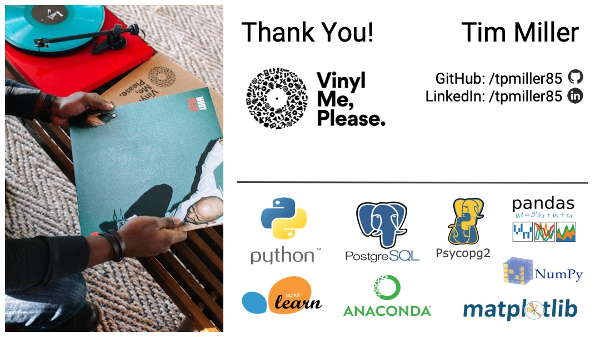

# Vinyl Me, Please - Guide To *Vinyl Noobs*

## Table of Contents  
* [Company Overview](##overview) 
* [Data & Goals](##data_goals) 
* [Data Pipeline](##data_pipeline) 
* [Exploratory Data Analysis (EDA)](##eda) 
* [How Does VMP Attract *Vinyl Noobs*? - Natural Language Processing](##attract) 
  * [SKLearn LDA Topic Modeling with 5 topics for “Noobs”](##lda)
* [How Does VMP Retain *Vinyl Noobs*? - Decision Tree Classifiers](##retain)
  * [Model Selection](##model_selection)
  * [AdaBoost Results](##adaboost)
* [Conclusions & Future Work](##concl)

## Company Overview
In their own words, Denver-based **Vinyl Me, Please.** is *"a record of the month club. The best damn record club out there, in fact."* They work with artists, labels and production facilities to re-issue old records, as well as release new albums. Their business model includes both monthly record club subscriptions as well as individual record sales. They have a large number of unique releases, and there are three **'release tracks'** that users can subscribe to: **Essentials**, **Classiscs**, and **Rap & Hip-Hop**.

## Data & Goals
The data for this project came from two sources: the main Vinyl Me, Please **Production/Sales PostgreSQL** Database, and the response data from a large **customer survey**, which was available in **.csv** format.

For this project, my main focus was on the **customer survey data**, since not much work had been done yet with this data set. The goal was to utilize customer-level data from the production database such as total lifetime revenue and account status (active/canceled), and to merge it with the survey response data in order to produce new insights.

## Data Pipeline  
I restored the PostgreSQL database dump I was given access to into a **PostgreSQL database** running in a **Docker container on my local system**. From there, I established a pipeline to **Python** using **Psycopg 2**. The **.csv survey data** was read directly into a Python environment using **pandas**, and the two data sources were able to be joined using the customer email address as a key. Since they surveys were originally sent out using the customer account email, all of the email addresses matched up.

Throughout the project, all data was saved outside of this git repo in order to protect any **Personally Identifiable Information (PII)** contained in the data.

## Exploratory Data Analysis (EDA)
The customer survey included over **120 questions**, and was filled out by approx. **6,200 customers**. The responses were a mix of the following types:
* Numerical
* Multiple-Choice
* Free-form text answers

For multiple choice questions, each possible selection was encoded as a new column, so the resulting data set was approx. 6200 rows x 450 columns.

My initial findings (using some of the methods described below) showed tht the **most valuable customers for Vinyl Me, Please are long-time vinyl buyers**, who have been buying vinyl for 15+ years. While this is good to know, this is also a fairly limited market, so my focus shifted to answering the following questions:

* ### How does Vinyl Me, Please **attract** NEW vinyl buyers (*vinyl noobs*)?
* ### How does Vinyl Me, Please **retain** *vinyl noobs* as subscribers?

I was able to look at just *vinyl noobs* by subsetting the survey responses. I selected all users whp reported that they had been **buying vinyl records for 0 - 3 years**, which reduced the responses from 6,200 customers to 2,100 customers.

## How Does VMP Attract *Vinyl Noobs*? - Natural Language Processing
A good proxy for how to attract people who are new to vinyl was to see how *vinyl noobs* answered the survey question: **"Why did you start buying vinyl originally?"**. Since these were free-form text responses, I built a class ([survey_nlp.py](src/models/survey_nlp.py)) that performed four different types of **Natural Language Processing** (NLP) in order to find the main topics that were covered in the responses. I implemented and compared the following algorithms:

* SKLearn LDA ([Wikipedia](https://en.wikipedia.org/wiki/Latent_Dirichlet_allocation)/[SKLearn](https://scikit-learn.org/stable/modules/generated/sklearn.decomposition.LatentDirichletAllocation.html))
* SKLearn NMF([Wikipedia](https://en.wikipedia.org/wiki/Non-negative_matrix_factorization)/[SKLearn NMF](https://scikit-learn.org/stable/modules/generated/sklearn.decomposition.NMF.html))
* Gensim LDA ([Wikipedia](https://en.wikipedia.org/wiki/Latent_Dirichlet_allocation)/[Gensim](https://radimrehurek.com/gensim/models/ldamodel.html))
* Mallet LDA using Gensim wrapper ([Wikipedia](https://en.wikipedia.org/wiki/Latent_Dirichlet_allocation)/[Gensim](https://radimrehurek.com/gensim/models/wrappers/ldamallet.html)/[Mallet homepage](http://mallet.cs.umass.edu))

In the end, the **SKLearn LDA** algorithm seemed to provide the clearest topics for this data set.

### SKLearn LDA Topic Modeling with 5 topics for “Noobs”:

| Topic | Keywords |
| --- | --- |
| Topic 1: Gifts | player, **record player**, record, got, **gift**, turntable, got record, **got record player**, **gifted**, received, **birthday**, way listen, **christmas**, gave, given |
| Topic 2: Nostalgic Hipsters | 2017, wanted support, **wanted support artists**, support artists, downhill, display, christmas, huge, felt, **childhood**, **beautiful**, **form music**, turntable christmas, **memories**, **passionate** |

Some clear topics emerged from the analysis. I've only listed the top two topics that resulted from running the model with a total of five topics. The biggest takeaway here might be that a gift pack or similar that includes a relatively inexpensive record player and a subscription might be an excellent way to get new people involved in vinyl.

## How Does VMP Retain *Vinyl Noobs*?
To answer this question, I **encoded 113 of the numerical and multiple-choice columns** of survey responses in order to build a model. I built 10 different methods in the [build_survey_features.py](src/features/build_survey_features.py) script, which were then run on different sets of columns. Once this was complete, the **customer account status** (active/canceled) was added in from the PostgreSQL database using the [survey_join_account_data.py](src/features/survey_join_account_data.py) script.

### Model Selection
Since the goal was to predict the customer account status (Active/Canceled) using a large number of features (113 columns), I focused on **decision tree classifier models**. Specifically, I implemented GradientBoostingClassifier and AdaBoostClassifier models in the [create_models.py](src/models/create_models.py) class. This class takes the feature-engineered data, makes a train/test split, performs a grid search, pickles and then saves the chosen model.

In the end, the **AdaBoostClassifier** model was slightly more accurate, and also significantly faster to train (in part due to the fact that there are fewer parameters to search).

### AdaBoost Results
I built the model with a binary prediciton target, with `0` being customer retention (account status `active`) and `1` being customer churn (account status `canceled`).

AdaBoostClassifier model provides us with the relative [feature importances](https://scikit-learn.org/stable/auto_examples/ensemble/plot_forest_importances.html) for its model, which should correspond to the things that can most closely predict if a customer will churn.

However, the feature importances do not tell us what effect those predictors are actually having on the model. In order to see this, we can examine [partial dependence plots](https://scikit-learn.org/stable/modules/partial_dependence.html). 

Since in this case `1` (or up) means customer churn, these partial dependence plots for the most important two features show that customers under the age of 30 have an increased risk of churn, as well as customers who are dissatisfied with the Record Of The Month.

## Conclusions & Future Work
All of the code tools for this project were built to they could be easily adapted to provide new insights. The Natural Language Processing pipeline, [survey_nlp.py](src/models/survey_nlp.py), can be run on any of the free-form answer questions, using either the full population, or just *vinyl noobs*. 

The decision tree classifier pipeline could also easily be adapted to analyze the full survey response data set as opposed to just the *vinyl noobs*, and different questions could easily be added to or removed from the model.

