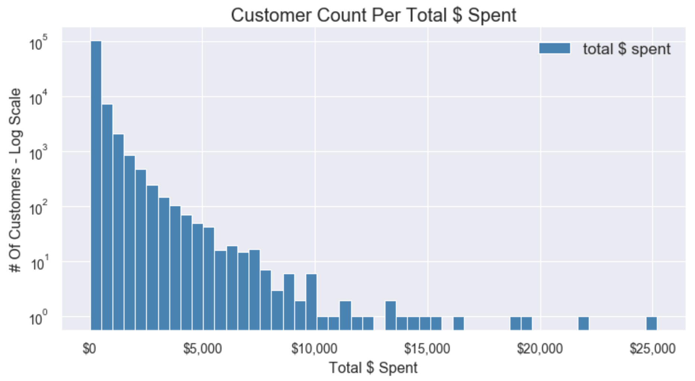
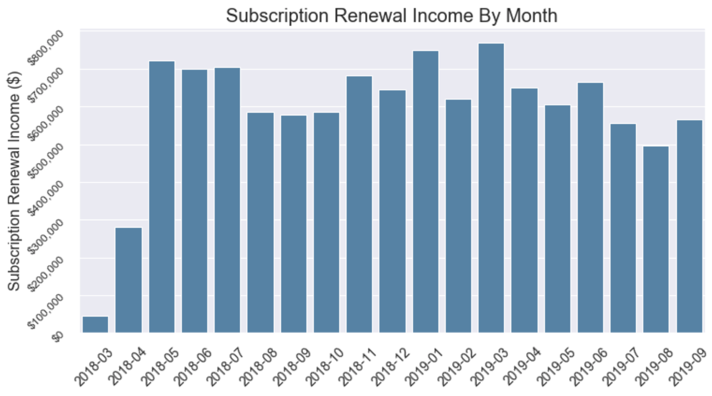
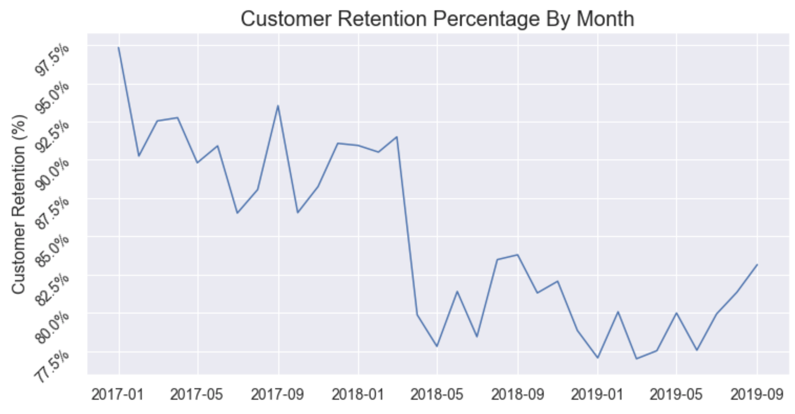
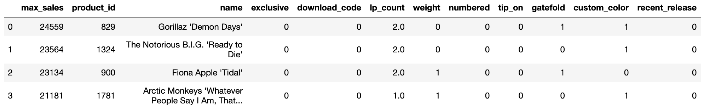
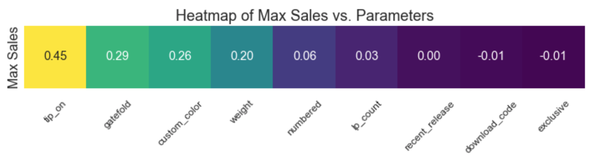
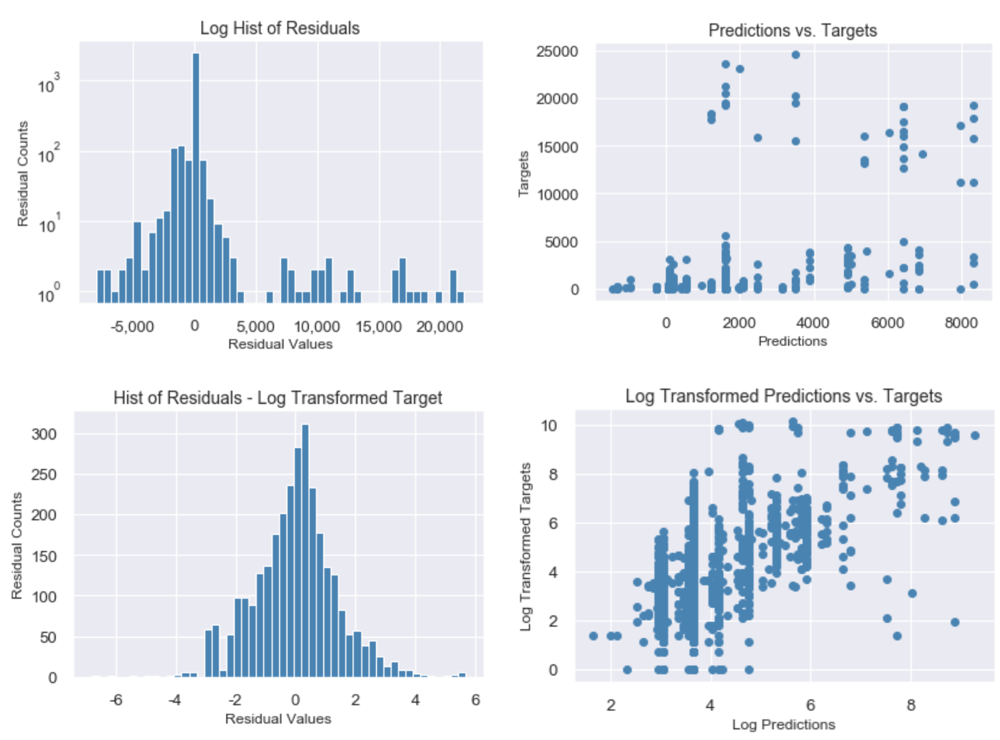

# Vinyl Me, Please

[](https://www.vinylmeplease.com)

## Table of Contents  
* [Overview & Goals](##overview)<BR>
* [Data Pipeline](##data_pipeline)<BR>
* [General Exploratory Data Analysis (EDA)](##eda)<BR>
* [Business Analytics](##analytics)<BR>
  * [Customer Count Per Total $ Spent](##spending)
  * [Subscription Renewal Income By Month](##renewal_income)
  * [Customer Retention Percentage By Month](##retention)
* [Exploring Factors Corellated With Album Sales](##album_sales)
  * [Album Release-Specific Exploratory Data Analysis (EDA)](##sales_eda)
  * [Feature Selection and Cleaning](##feat_selec)
  * [Pandas DataFrame For Modeling](##model_df)
  * [Variance Inflation Factor (VIF)](##vif)
  * [Linear Model With And Without Log Transformed Target](##models)
  * [Interpreting Coefficients](##coeffs)
  * [Conclusions & Future Work](##concl)

<a name="#overview"></a>

## Overview & Goals  
In their own words, Denver-based **Vinyl Me, Please.** is *"a record of the month club. The best damn record club out there, in fact."* They work with artists, labels and production facilities to re-issue old records, as well as release new albums. Their business model includes both monthly record club subscriptions as well as individual record sales. They have a large number of unique releases, and there are three **'release tracks'** that users can subscribe to: **Essentials**, **Classiscs**, and **Rap & Hip-Hop**.

[](https://www.vinylmeplease.com)
[](https://www.vinylmeplease.com)

I had the privilege of working with their **production database**. Going into this project, my **goals** included the following:
* Work with the team at *Vinyl Me, Please.* to provide meaningful insights for their business.
* Gain experience wrangling messy, real-world data, including building a data pipeline from a SQL database to Python data analysis and visualization tools that can be adapted to future
uses.
* Gain experience with modeling techniques to provide relevant business insights:
   * Are there album attributes that might contribute to the popularity of a certain release within the *Vinyl Me, Please.* ecosystem?
   * What insights into customer behavior can be gained from this data set?


<a name="#data_pipeline"></a>

## Data Pipeline  
The team at *Vinyl Me, Please.* gave me access to a **13GB PostgreSQL database dump**. This production/sales database consists of **118 separate tables**, which relate to various customer, product and transaction history details. In order to work with the database, I restored the DB dump into a **PostgreSQL database** running in a **Docker container on my local system**. From there, I established a pipeline to **Python** using **psycopg 2**.

Working in both PostgreSQL and Python allowed me to choose which language would most easily be able to handle a given task. On the SQL side, I built queries that **joined up to five tables**, and made use of convenient **SQL aggregation functions**.

<a name="#eda"></a>

## General Exploratory Data Analysis (EDA)
**How does one make sense of a production database that consists of 118 tables?** I found two PostgreSQL utility queries that proved to be invaluable when dealing with such a large database (see src/sql_utility_queries.sql). Sample output:

```SQL
-- List all tables sorted by size:
                     relation                     | total_size 
--------------------------------------------------+------------
 chargebee_events                                 | 5830 MB
 ledger_entries                                   | 1441 MB
 chargebee_sync_operations                        | 1139 MB
 chargebee_invoices                               | 1097 MB
 shoppe_orders                                    | 579 MB
(118 rows)

-- Find all tables that contain a column name LIKE '%active%':
 table_schema |        table_name         
--------------+---------------------------
 public       | customer_features
 public       | customer_plan_tiers
 public       | features
(8 rows)
```

<a name="#analytics"></a>

## Business Analytics
A significant goal of mine was to perform some fairly standard business analytics on the database, using my PostgreSQL/psycopg2/Python workflow. I did not perform any modeling here, and the data was fairly clean and complete, but I think the insights gained are still valuable, and the scripts I created could easily be adapted to production usage.

<a name="#spending"></a>

### Customer Count Per Total $ Spent

This chart shows the distribution of customers based on their total lifetime spending in $USD with *Vinyl Me, Please.* The y-axis is on a log scale in order to show the high-spending outliers, despite most accounts being clustered near $0.

<a name="#renewal_income"></a>

### Subscription Renewal Income By Month

There was a move to a new subscription billing system in 2018-04, which explains the data in those months. The numbers show that there is not a huge amount of variation in monthly subscription income.

<a name="#retention"></a>

### Customer Retention Percentage By Month

The customer retention rate was calculated using the following formula [(reference)](https://www.evergage.com/blog/how-calculate-customer-retention/):
* Customer Retention Rate = **((E-N)/S) * 100**

Where:
* **E** = Number of customers at the end of a period
* **N** = Number of new customers acquired during that period
* **S** = Number of customers at the start of that period

In this case, these customer numbers were calculated by **summing up the total number of Activation and Cancellation events from the beginning of the database** up through the beginning or end of the time period in question, as needed.

The retention rates are also fairly consistent, with the exception of 2018-03 / 2018-04. This drop might possibly be explained by 3-month gift subscriptions expiring that were given over the holidays. Further investigation might be able to confirm this.

<a name="#album_sales"></a>

## Exploring Factors Corellated With Album Sales
My main focus in this project was to explore whether any attributes of a given album release might be corellated with its sales numbers. My focus was to build an inferential model with interpretable coefficients rather than a predictive model. In order to get a handle on the available data, I did some release-specific EDA.

<a name="#sales_eda"></a>

### Album Release-Specific Exploratory Data Analysis (EDA)

The general distribution of albums vs. number of sales looked fairly similar whether I plotted total lifetime sales numbers, or maximum 30- or 90-day sales rollup numbers, so I decided to use 90-day sales rollup numbers for each release, since that metric should not penalize fairly recent releases vs. releases that have been selling for years.

The y-axis is on a log scale, since most releases have relatively low sales numbers, but there are is another group of 'super-hits' much higher up the scale.

<a name="#feat_selec"></a>

### Feature Selection and Cleaning
A significant amount of effort went into exploring all of the tables within the database, and mapping out which tables would need to be joined together in order to provide interesting insights related to album sales. For example, here is one entry from the 'releases' table:

```SQL
-- Example record from 'releases' table:
-[ RECORD 1 ]-------------+---------------------------------------
id                        | 519
artist_id                 | 261
product_id                | 829
title                     | Demon Days
exclusive                 | 0
kind                      | 1
total_quantity            | 
mastering_engineer        | Barry Grint
mastering_studio          | Alchemy Mastering
pressing_location         | GZ Media
disc_format               | 0
lp_count                  | 2
speed                     | 0
weight                    | standard
jacket_type               | Gatefold
jacket_style              | Direct-To-Board
extras                    | Full-Color Sticker Pack
label                     | Warner Bros Records
release_year              | 2005
download_code             | f
vinyl_size                | 0
remastering_details       | 1
color                     | Red Translucent
upc                       | 
vanity_url                | demon_days_vinyl
subscription_schedule_url | vol-52-gorillaz-demon-days
video_url                 | 
exclusive_properties      | {remastering_details,color,extras,mastering_studio,mastering_engineer}
created_at                | 2018-08-21 15:50:19.994693
updated_at                | 2018-10-30 20:33:19.007816
foil_stamped              | f
numbered                  | f
custom_feature_a          | 2LP Red Demon Days Vinyl
custom_feature_b          | Gatefold Jacket
custom_feature_c          | Half Speed Remastered for Vinyl at Alchemy
custom_feature_d          | Exclusive Gorillaz sticker pack with record
```

The `releases` table includes 36 columns of information for each album release, but the full album name is listed in the `shoppe_product_translations` table, and sales information is in the `product_sales_rollups` table. In the end, selecting 21 columns from a 3-way table join provided the following results for each release in the database. I decided on these attributes based on their value counts across the tables in question.

```SQL
-- Example record from custom table for modeling:
--[ RECORD 1 ]----------------------
max_sales     | 24559
product_id    | 829
name          | Gorillaz 'Demon Days'
exclusive     | 0
download_code | f
color         | Red Translucent
lp_count      | 2
weight        | standard
release_year  | 2005
numbered      | f
jacket_type   | Gatefold
jacket_style  | Direct-To-Board
```

I built Python classes to perform my PostgreSQL queries via psycopg2 and then clean and process the resuls. Because of the choice of my features, I was able to binary-encode most of them. Some examples of data cleaning techniques that were used:
* Filled Null values, generally with `0` (`not feature`), depending on the feature.
* Set `custom_color` to `1` where color was anything other than `black` or `None`.
* Concatenated text in `jacket_type` and `jacket_style` columns and creating binary `tip-on` and `gatefold` columns based on presence of keywords, while accounting for different spellings (e.g. `tip-on`, `Tip on`, `Tip-on`, `Tip-On`).

<a name="#model_df"></a>

### Pandas DataFrame For Modeling


### Basic Heatmap
Before moving forward with any modeling, it can be helpful to make a quick heatmap showing initial corellation between the raw predictors and the target:


<a name="#vif"></a>

### Variance Inflation Factor (VIF)
Since my goal is to have very **interpretable coefficients**, I chose to build a **linear regression model**. Linear models are sensitive to multicollinearity within predictors, so I will perform a **VIF analysis**.

From [Wikipedia](https://en.wikipedia.org/wiki/Variance_inflation_factor): *The variance inflation factor (VIF) is the quotient of the variance in a model with multiple terms by the variance of a model with one term alone. It quantifies the severity of multicollinearity in an ordinary least squares regression analysis.*

| VIF Factor | feature_name | Description
| --- | --- | --- |
| `1.1` | `exclusive` | Is this release exclusive to *Vinyl Me, Please*? |
| `1.2` | `download_code` | Is there a digital download code included with this record? |
| `1.4` | `lp_count` | How many vinyl records are included in this release? |
| `1.3` | `weight` | Is this a heavier-weight pressing (180g or 200g)? |
| `1.7` | `numbered` | Is this a numbered/limited-run release? |
| `1.3` | `tip_on` | Is this a Tip-On jacket, where the cover print is done on a separate sheet of text-stock paper, and then wrapped/glued to a thick corrugated core? | 
| `1.1` | `gatefold` | Is this a gatefold sleeve, which opens like a book? |
| `2.2` | `custom_color` | Is the vinyl record any color other than black? |
| `1.5` | `recent_release` | Was the original release year 2015 or newer? |

The VIF analysis showed no collinearity between predictors (no values > 5), so all predictors can be retained.

<a name="#models"></a>

### Linear Model With And Without Log Transformed Target
I fit linear models both using the standard target values (# of albums sold) and using log-tranformed target values. The process was the same for both models:
* Fit linear model to predictor matrix (X).
* Perform Ordinary Least Squares (OLS) Regression statsmodels Python package.
* Drop any predictors that are not significant with a 95% confidence interval.
  * Standard target: drop `download_code`, `lp_count`, and `weight`.
  * Log-transformed target: drop `exclusive`, `download_code`, and `weight`.
* Re-fit model.



The charts above show that the linear model using the log-tranformed targets does a better job of capturing the trends in the data.

<a name="#coeffs"></a>

### Interpreting Coefficients
The table below shows the coefficients for the linear model with the log-transformed targets. 

| Attribute | Coefficient (log-transformed) | Attribute corellated to increase in sales # by a factor of: |
| --- | --- | --- |
| `tip_on` | `2.97` | **19.5 x** |
| `numbered` | `1.16` | **3.2 x** |
| `custom_color` | `1.09` | **3.0 x** |
| `gatefold` | `1.00` | **2.7 x** |
| `lp_count` | `-0.11` | **0.90 x** |
| `recent_release` | `-0.60` | **0.55 x** |

<a name="#concl"></a>

## Conclusions & Future Work
* While the album sales numbers are difficult to predict on, I can say with relative confidence that records that have premium packaging, are from a numbered release and have custom vinyl colors are corellated with higher sales numbers for *Vinyl Me, Please.*
* Having both PostgreSQL and Python available makes it possible to decide which language is better suited to the task at hand.
* In order to make a more causal statement about factors that influence album sales, it would be necessary to pull in additional data sources, and do things like normalize for industry-wide album popularity.
* There is a lot of room for additional work around customer behavior, especially if the company's additional data set of customer surveys is taken into account.