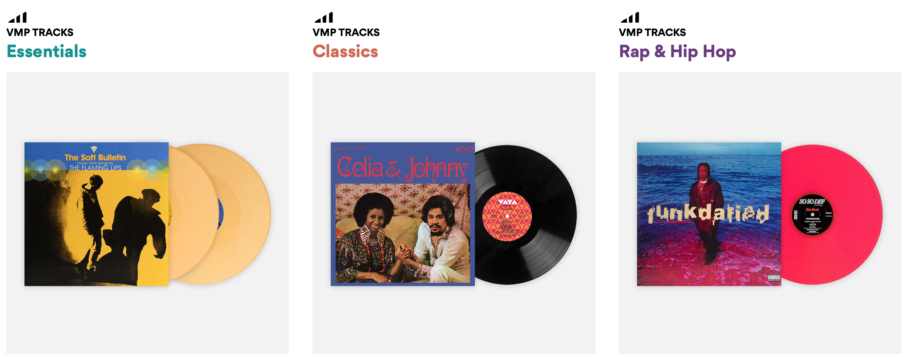
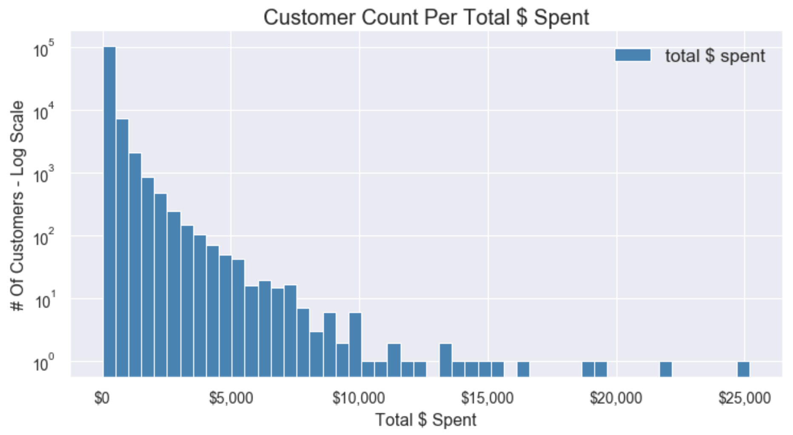
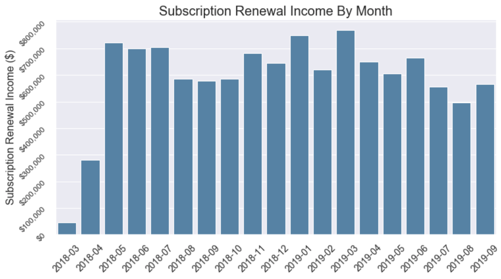
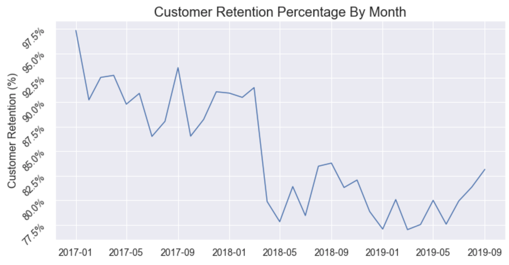
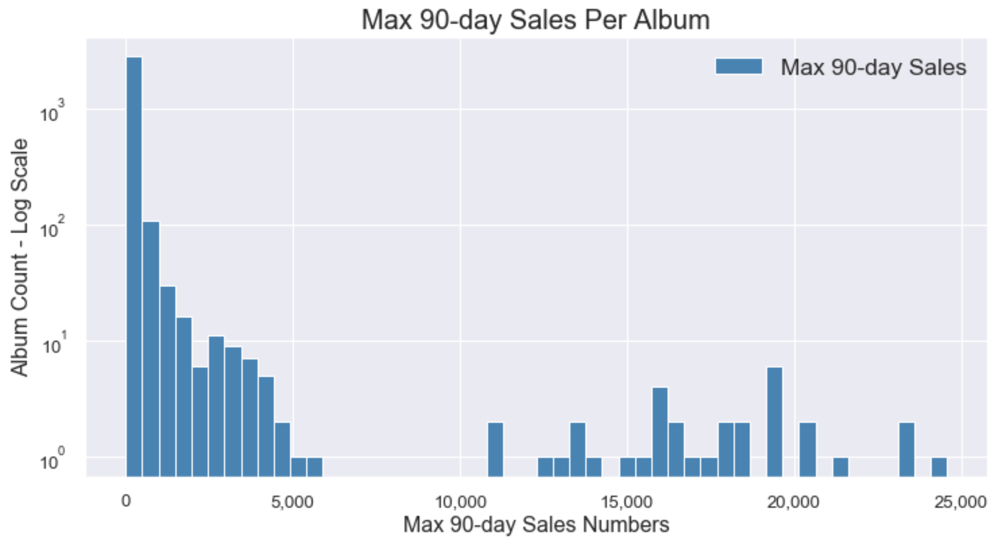
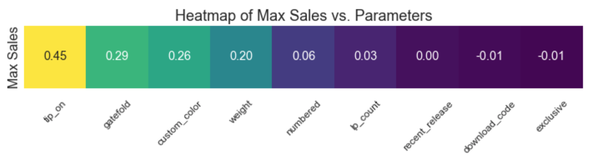
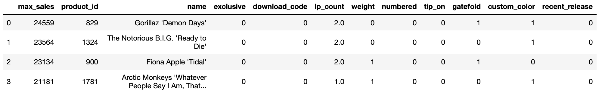

# Vinyl Me, Please

[](https://www.vinylmeplease.com)


## Table of Contents  
* [Overview & Goals](##overview)<BR>
* [Data Pipeline](##data_pipeline)<BR>
* [Exploratory Data Analysis (EDA)](##eda)<BR>

* [Conclusion and Future Project Ideas](##conclusion_future)<BR>


<a name="#overview"></a>

## Overview & Goals  

In their own words, Denver-based Vinyl Me, Please. is "a record of the month club. The best damn record club out there, in fact." They work with artists, labels and production facilities to re-issue old records, as well as release new albums. Their business model includes both monthly record club subscriptions as well as individual record sales. They have a large number of unique releases, and there are three 'release tracks' that users can subscribe to: Essentials, Classiscs, and Rap & Hip-Hop.

[](https://www.vinylmeplease.com)
[](https://www.vinylmeplease.com)

I had the privilege of working with their production database. Going into this project, my goals included the following:
* Work with the team at ‘Vinyl Me, Please’ to provide meaningful insights for their business.
* Gain experience wrangling messy, real-world data, including building a data pipeline from a SQL database to Python data analysis and visualization tools that can be adapted to future
uses.
* Gain experience with modeling techniques to provide relevant business insights:
   * Are there album attributes that might contribute to the popularity of a certain release within the ‘Vinyl Me, Please’ ecosystem?
   * What insights into customer behavior can be gained from this data set?


<a name="#data_pipeline"></a>

## Data Pipeline  

The team at Vinyl Me, Please. gave me access to a 13GB PostgreSQL database dump. This production/sales database consists of 118 separate tables, which relate to various customer, product and transaction history details. In order to work with the database, I restored the DB dump into a PostgreSQL database running in a Docker container on my local system. From there, I established a pipeline to Python using psycopg 2.

Working in both PostgreSQL and Python allowed me to choose which language would most easily be able to handle a given task. On the SQL side, I built queries that joined up to five tables, and made use of convenient SQL aggregation functions.

<a name="#eda"></a>

## Exploratory Data Analysis (EDA)

How does one make sense of a production database that consists of 118 tables? I found two PostgreSQL utility queries that proved to be invaluable when dealing with such a large database (see src/sql_utility_queries.sql). Sample output:

```SQL
-- List all tables sorted by size:
                     relation                     | total_size 
--------------------------------------------------+------------
 chargebee_events                                 | 5830 MB
 ledger_entries                                   | 1441 MB
 chargebee_sync_operations                        | 1139 MB
 chargebee_invoices                               | 1097 MB
 shoppe_orders                                    | 579 MB
(118 rows)

-- Find all tables that contain a column name LIKE '%active%':
 table_schema |        table_name         
--------------+---------------------------
 public       | customer_features
 public       | customer_plan_tiers
 public       | features
(8 rows)
```

## Business Analytics

A significant goal of mine was to perform some fairly standard business analytics on the database, using my PostgreSQL/psycopg2/Python workflow. I did not perform any modeling here, and the data was fairly clean and complete, but I think the insights gained are still valuable, and the scripts I created could easily be adapted to production usage.

* Customer Count Per Total $ Spent

This image is plotted on a log 










* Customer Count per Total Spent
* Subscription Renewal Income By Month
* Customer Retention Chart


A significant amount of effort went into exploring all of the tables within the database, and mapping out which tables would need to be joined together in order to provide interesting insights. For example, here is one entry from the 'releases' table:

```SQL
SELECT * FROM releases WHERE product_id = 829;
-[ RECORD 1 ]-------------+---------------------------------------
id                        | 519
artist_id                 | 261
product_id                | 829
title                     | Demon Days
exclusive                 | 0
kind                      | 1
total_quantity            | 
mastering_engineer        | Barry Grint
mastering_studio          | Alchemy Mastering
pressing_location         | GZ Media
disc_format               | 0
lp_count                  | 2
speed                     | 0
weight                    | standard
jacket_type               | Gatefold
jacket_style              | Direct-To-Board
extras                    | Full-Color Sticker Pack
label                     | Warner Bros Records
release_year              | 2005
download_code             | f
vinyl_size                | 0
remastering_details       | 1
color                     | Red Translucent
upc                       | 
vanity_url                | demon_days_vinyl
subscription_schedule_url | vol-52-gorillaz-demon-days
video_url                 | 
exclusive_properties      | {remastering_details,color,extras,mastering_studio,mastering_engineer}
created_at                | 2018-08-21 15:50:19.994693
updated_at                | 2018-10-30 20:33:19.007816
foil_stamped              | f
numbered                  | f
custom_feature_a          | 2LP Red Demon Days Vinyl
custom_feature_b          | Gatefold Jacket
custom_feature_c          | Half Speed Remastered for Vinyl at Alchemy
custom_feature_d          | Exclusive Gorillaz sticker pack with record
```

The 'releases' table includes 36 columns of information for each album release, but the full album name is listed in the 'shoppe_product_translations' table, and sales information is in the 'product_sales_rollups' table. In the end, selecting 21 columns from a 3-way table join provided the following results for each release in the database. I decided on these attributes based on their value counts across the tables in question.

```SQL
--[ RECORD 1 ]----------------------
max_sales     | 24559
product_id    | 829
name          | Gorillaz 'Demon Days'
exclusive     | 0
download_code | f
color         | Red Translucent
lp_count      | 2
weight        | standard
release_year  | 2005
numbered      | f
jacket_type   | Gatefold
jacket_style  | Direct-To-Board
```

I built Python classes to perform my PostgreSQL queries via psycopg2 and then clean and process the resuls. Because of the choice of my features, I was able to binary-encode most of them. Some examples of data cleaning techniques that were used:
* Filled Null values, generally with 0 ('not feature'), depending on the feature.
* Set 'custom_color' to 1 where color was anything other than 'black' or None.
* Concatenated text in 'jacket_type' and 'jacket_style' columns and creating binary 'tip-on' and 'gatefold' columns based on presence of keywords, while accounting for different spellings (e.g. 'tip-on', 'Tip on', 'Tip-on', 'Tip-On').

The following pandas table was the result. 




- Business Analytics:
- not much cleaning
- few NANs


- Deep dive on album sales numbers and factors
* Plot Total # Sales vs. Releases

TABLE VIF

['Is this release exclusive to Vinyl Me, Please?',
                        'Is there a digital download code included with this record?',
                        'How many vinyl records are included in this release?',
                        'Is this a heavier weight pressing (180g or 200g)?',
                        'Is this a numbered/limited-run release?',
                        'Is this a Tip-On jacket, where the cover print is done on a separate sheet of text-stock paper, and then wrapped/glued to a thick corrugated core?',
                        'gatefold',
                        'color',
                        'recent']


* Album attributes corellated with MAX(sales.quantity_90d)

"Describe the process you used to ensure your model was properly fit."

discussion of the cleaning and featurization pipeline and how raw data were transformed to the data trained on.